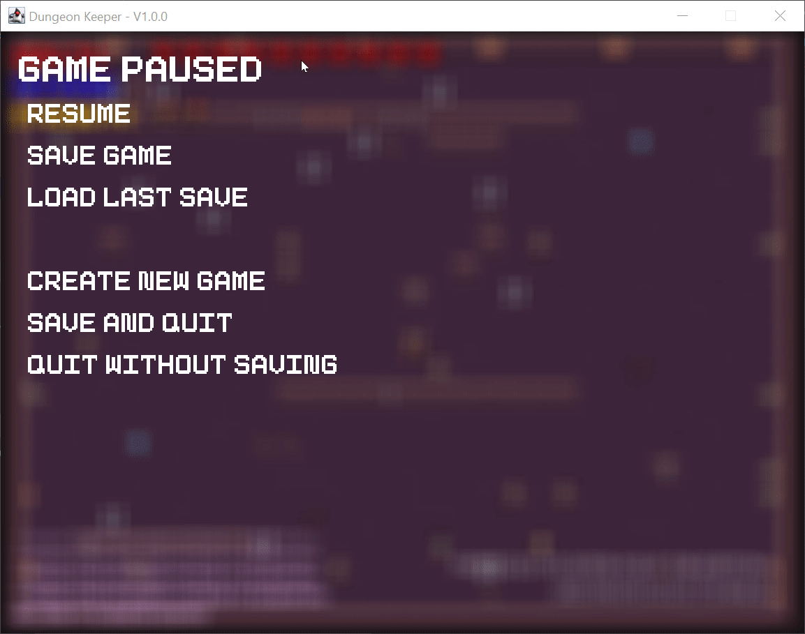

# Dungeon Keeper
## Top-down rouge-like dungeon crawler for CPSC 210. 

Dungeon Keeper is a project aimed at creating a top-down
sprite and text-based roguelike dungeon crawler similar to Dwarf Fortress and
Dungeon Crawl Stone Soup. In short, it is a game about fighting enemies and
exploring dungeons, while trying to stay alive.

### [> Try Web Demo <](https://dungeonkeeper.hydranet.dev)
> Instructions for setting up the webserver are [here](server/README.md).

### [> Open Original README File <](README_ORIGINAL.md)

# Features
## Fully Featured GUI and Hoverable Tooltips

## Full Inventory System

## Saving and Loading Game
> This works in the web demo as well! Try it out!  

## Procedurally Generated Levels

## 100% Compatibility with Terminal UI

## 100% Test Code Coverage

## Intellij-generated UML diagram of the project
